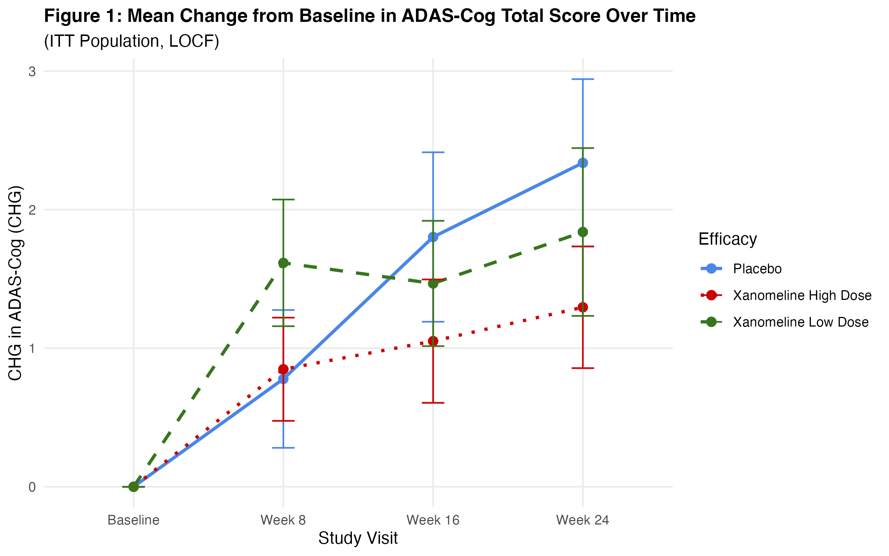
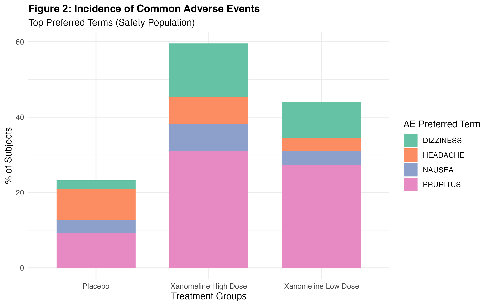

# CDISC ADaM Efficacy & Safety Clinical Programming Pipeline

An end-to-end **clinical data analysis and reporting pipeline in R** designed to demonstrate clinical programming practices aligned with **CDISC ADaM standards**.

The project simulates a regulatory-oriented clinical trial programming workflow covering **data ingestion, analysis population derivation, efficacy and safety analyses, statistical summaries, visualization, automated reporting, and independent QC validation**.

---

## 📌 Project Overview

This repository demonstrates a complete clinical programming workflow using analysis datasets based on:

* **ADSL** — Subject-Level Analysis Dataset
* **ADAE** — Analysis Dataset for Adverse Events
* **ADADAS** — Analysis Dataset for ADAS-Cog efficacy assessments

The pipeline produces analysis tables, visualizations, documentation, and an automated QC report.

### Key Capabilities

* CDISC ADaM-aligned analysis dataset processing
* Analysis population derivation
* Baseline and demographic summaries
* Safety and adverse event analysis
* Primary efficacy analysis
* LOCF-based endpoint analysis
* Statistical summary generation
* Publication-ready visualizations using `ggplot2`
* Automated Word report generation using `flextable` and `officer`
* Independent double-programming QC
* Automated dataset reconciliation using `diffdf`

---

# 🧬 Clinical Standards & Analytical Scope

## CDISC Standards

The pipeline is designed around the following ADaM datasets:

| Dataset    | Purpose                                                                 |
| ---------- | ----------------------------------------------------------------------- |
| **ADSL**   | Subject-level demographics, treatment information, and population flags |
| **ADAE**   | Adverse event analysis and treatment-emergent safety summaries          |
| **ADADAS** | ADAS-Cog efficacy analysis and endpoint derivations                     |

> **Note:** `ADADAS` is used in this project as a study-specific analysis dataset for ADAS-Cog assessments.

---

## 👥 Analysis Population Flags

The pipeline derives the following analysis population flags:

| Flag      | Description                                                                 |
| --------- | --------------------------------------------------------------------------- |
| `SAFFL`   | Safety Population — subjects receiving at least one dose of study treatment |
| `ITTFL`   | Intent-to-Treat Population — randomized subjects                            |
| `ANL01FL` | Primary efficacy analysis flag                                              |

These flags are subsequently used to define the appropriate populations for safety and efficacy analyses.

---

# 🎯 Primary Endpoints

## Efficacy Endpoint

**ADAS-Cog Total Score**

The primary efficacy analysis evaluates:

* Baseline ADAS-Cog Total Score
* Week 24 ADAS-Cog Total Score
* Change from baseline (`CHG`)
* Analysis value (`AVAL`)
* LOCF-based imputation for missing Week 24 assessments

The resulting analysis is summarized by treatment arm.

---

## 🛡️ Safety Endpoint

**Treatment-Emergent Adverse Events**

Safety analyses include subject-level incidence summaries of adverse events categorized by:

* System Organ Class (`AESOC`)
* Preferred Term (`AEDECOD`)
* Treatment arm

The analysis focuses on subject incidence rather than simply counting raw AE records.

---

# 🏗️ Repository Architecture

```text
cdisc-clinical-r-pipeline/
│
├── 01_data_ingestion.R
│   └── Ingestion and validation of raw CDISC domain structures
│
├── 02_table_demographics.R
│   └── Table 1: Baseline Demographics & Characteristics (ADSL)
│
├── 03_table_safety.R
│   └── Table 2: Safety Overview & AE Treatment-Emergent Summary (ADAE)
│
├── 04_table_efficacy.R
│   └── Table 3: Primary Efficacy LOCF Analysis (ADADAS)
│
├── 05_documentation_and_summary.R
│   └── Table 4: Multi-visit Summary Matrix & Pipeline Documentation
│
├── 06_visualization.R
│   └── Figure 1: ADAS-Cog Efficacy Line Chart
│
├── 07_Visualization_adverse_effects.R
│   └── Figure 2: AE Incidence by Treatment Arm
│
├── 08_validation_and_qc.R
│   └── Independent QC & Double-Programming Reconciliation
│
├── Pipeline_Documentation.md
│   └── Functional specification and derivation rules
│
├── QC_Validation_Report.txt
│   └── Independent validation summary and reconciliation logs
│
├── README.md
│   └── Project documentation
│
└── Pipeline/output/
    ├── Figure1_Efficacy_LineChart_Fixed.png
    ├── Figure2_AE_Incidence.png
    ├── Table_4_Summary_Statistics.docx
    └── QC_Validation_Report.txt
```

---

# 🛠️ Technical Stack

| Category                    | Technologies                                        |
| --------------------------- | --------------------------------------------------- |
| **Programming Language**    | R 4.0+                                              |
| **Data Manipulation**       | `tidyverse`, `dplyr`, `tidyr`, `stringr`, `forcats` |
| **Visualization**           | `ggplot2`                                           |
| **Reporting**               | `flextable`, `officer`                              |
| **Validation / QC**         | `diffdf`                                            |
| **Clinical Data Standards** | CDISC ADaM                                          |

---

# ⚙️ Getting Started

## Prerequisites

Install **R 4.0 or later**.

Install the required packages:

```r
install.packages(c(
  "tidyverse",
  "flextable",
  "officer",
  "diffdf"
))
```

---

# ▶️ Running the Pipeline

The scripts are designed to be executed sequentially from **01 through 08**.

### 1. Data Ingestion

```bash
Rscript 01_data_ingestion.R
```

Loads and validates the input analysis datasets and establishes the required data structures.

### 2. Demographics Table

```bash
Rscript 02_table_demographics.R
```

Generates baseline demographic and subject characteristic summaries from `ADSL`.

### 3. Safety Analysis

```bash
Rscript 03_table_safety.R
```

Generates safety and treatment-emergent adverse event summaries using `ADAE`.

### 4. Efficacy Analysis

```bash
Rscript 04_table_efficacy.R
```

Performs the primary ADAS-Cog efficacy analysis, including baseline change and LOCF handling.

### 5. Documentation & Summary

```bash
Rscript 05_documentation_and_summary.R
```

Generates the multi-visit summary matrix and supporting pipeline documentation.

### 6. Efficacy Visualization

```bash
Rscript 06_visualization.R
```

Creates the ADAS-Cog efficacy line chart.

### 7. Adverse Event Visualization

```bash
Rscript 07_Visualization_adverse_effects.R
```

Creates the adverse event incidence visualization by treatment arm.

### 8. Independent QC & Validation

```bash
Rscript 08_validation_and_qc.R
```

Performs independent derivation and reconciliation of key analysis outputs.

---

# 📊 Generated Outputs

The pipeline generates the following key deliverables:

### Tables

* Baseline Demographics & Characteristics
* Safety Overview & Treatment-Emergent AE Summary
* Primary Efficacy Analysis
* Multi-visit Summary Statistics

### Figures

* **Figure 1:** ADAS-Cog Total Score Over Time
* **Figure 2:** Adverse Event Incidence by Treatment Arm

### Reports

* Automated Word summary report
* Pipeline functional documentation
* QC validation and reconciliation report

---

## 🖼️ Figures

### Figure 1: ADAS-Cog Efficacy Over Time


Change from baseline in ADAS-Cog Total Score across visits, by treatment arm, with LOCF-based endpoint handling for Week 24.

### Figure 2: Adverse Event Incidence by Treatment Arm


Subject-level treatment-emergent adverse event incidence, summarized by System Organ Class and treatment arm.

---

# 🔍 Quality Control & Double Programming

Independent validation is an important component of clinical programming workflows.

The `08_validation_and_qc.R` script performs an **independent derivation of key analysis objects** and compares the independently generated results against the production outputs.

The validation uses:

```r
diffdf::diffdf()
```

to identify discrepancies between datasets.

## QC Scope

The validation process checks:

* Analysis population flag assignments
* Primary efficacy analysis values
* `AVAL`
* `CHG`
* Subject-level analysis records
* Cell-level summary statistics
* Key table outputs

### Pass Criteria

The pipeline is considered successfully validated when **zero unexpected mismatches** are identified across the predefined QC checks.

### QC Output

Validation results are automatically written to:

```text
output/QC_Validation_Report.txt
```

The report provides an audit-oriented record of the independent programming and reconciliation process.

---

# 📄 Documentation

Additional technical details are available in:

```text
Pipeline_Documentation.md
```

The documentation describes:

* Dataset structures
* Population derivation rules
* Analysis variable derivations
* Endpoint definitions
* LOCF methodology
* Table specifications
* QC methodology
* Pipeline execution requirements

---

# 🔄 Pipeline Workflow

```text
Raw / Analysis Data
        │
        ▼
┌─────────────────────┐
│ 01. Data Ingestion  │
└──────────┬──────────┘
           │
           ▼
┌────────────────────────────┐
│ Population & Variable      │
│ Derivations                │
└────────────┬───────────────┘
             │
       ┌─────┴─────┐
       ▼           ▼
   Efficacy      Safety
       │           │
       ▼           ▼
   ADADAS        ADAE
       │           │
       └─────┬─────┘
             ▼
      Tables & Figures
             │
             ▼
     Automated Reporting
             │
             ▼
      Independent QC
             │
             ▼
      Reconciliation
             │
             ▼
       Final Outputs
```

---

# 🎓 Skills Demonstrated

This project demonstrates practical knowledge of:

* Clinical trial data programming
* CDISC ADaM concepts
* ADSL / ADAE / efficacy analysis datasets
* Analysis population derivation
* Safety analysis
* Efficacy analysis
* Baseline and change-from-baseline calculations
* Missing data handling
* LOCF methodology
* Descriptive statistics
* R programming
* `dplyr` / `tidyr` data manipulation
* `ggplot2` visualization
* Automated Word reporting
* Independent double programming
* Dataset reconciliation
* Clinical programming QC principles

---

# 🚀 Project Objective

The objective of this project is to demonstrate an **end-to-end clinical programming workflow in R**, from analysis dataset ingestion through statistical analysis, reporting, visualization, and independent QC.

It is intended as a practical demonstration of how clinical programming concepts can be implemented in a reproducible and structured programming environment.

---

## 📌 Disclaimer

This is a **demonstration / portfolio project** using simulated or non-production clinical data.

It is **not intended for use in an actual regulatory submission or clinical decision-making**.

The implementation demonstrates programming concepts inspired by CDISC ADaM and clinical reporting workflows and should not be interpreted as a complete replacement for sponsor-specific standards, SAP requirements, validation procedures, or regulatory guidance.
